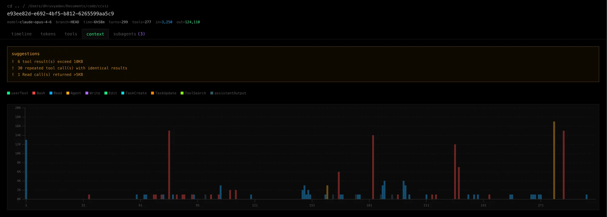
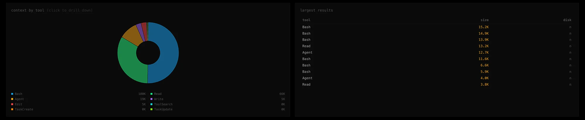

# ccviz

CLI tool to visualize [Claude Code](https://docs.anthropic.com/en/docs/claude-code) conversations. Opens a browser UI to explore conversation transcripts stored in `~/.claude/`, with focus on debugging MCP tool calls, identifying context bloat, and understanding token/timing patterns.






## Install

```bash
npm i -g ccviz
```

## Usage

```bash
# Start the browser UI
ccviz

# Custom port
ccviz --port 8080

# Don't auto-open browser
ccviz --no-open

# Dump a conversation as JSON (no server)
ccviz --json ~/.claude/projects/-Users-you-code-myproject/session-id.jsonl

# Open directly to a specific conversation
ccviz --conversation -Users-you-code-myproject/session-id
```

## Features

### Project Browser
- Hierarchical folder tree of all Claude Code projects in `~/.claude/projects/`
- Most recent conversations shown on the landing page
- Search/filter conversations by title, model, or session ID

### Conversation View

Five tabs for analyzing a conversation:

**Timeline** — Turn-by-turn view with expandable user/assistant messages. Each turn shows a context contribution bar (green→red heat scale) and expandable tool call cards with full input parameters and result previews.

**Tokens** — Stacked area chart of per-turn token usage (input, output, cache creation, cache read) and cumulative context growth line chart. Interactive tooltips and per-turn breakdown table.

**Tools** — Sortable table of all tool calls with duration, result size, and MCP server info. Aggregation bar charts for call count and result size by tool. Filter by tool name or MCP/native. Click any row to see full input/output.

**Context** — Per-tool stacked bar chart showing exactly which tools cause context spikes at each turn. Click any bar segment to inspect the tool calls. Pie chart of context consumption by tool category — click a slice to drill down and see every call with input params and results. Optimization suggestions flag large results, repeated calls, and oversized reads.

**Subagents** — List of spawned subagents with token usage comparison bars. Click to expand and see the subagent's own timeline.

## Data Source

Reads conversation transcripts from `~/.claude/projects/`. Each project directory contains `.jsonl` files (one per conversation) with the full message history, tool calls, token usage, and subagent transcripts.

## Tech Stack

- **CLI**: Node.js, Commander, `open`
- **Server**: Express 5
- **Parser**: Streaming JSONL parser (handles 25MB+ conversations)
- **UI**: React 19, Vite, Tailwind CSS v4, [visx](https://airbnb.io/visx/) for visualizations
- **Build**: tsup (server), Vite (UI)

## Development

```bash
git clone https://github.com/dhruvyad/ccviz.git
cd ccviz
npm install
npm run dev    # Starts Express + Vite dev server with HMR
npm run build  # Production build
npm start      # Run production build
```

## License

[MIT](LICENSE)
